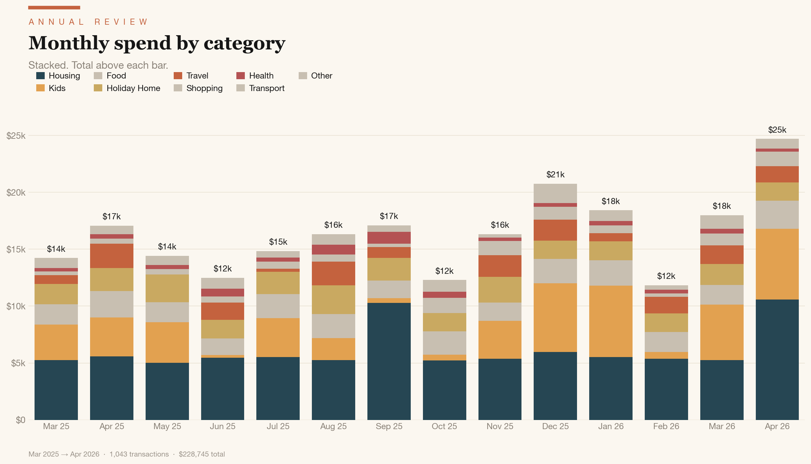
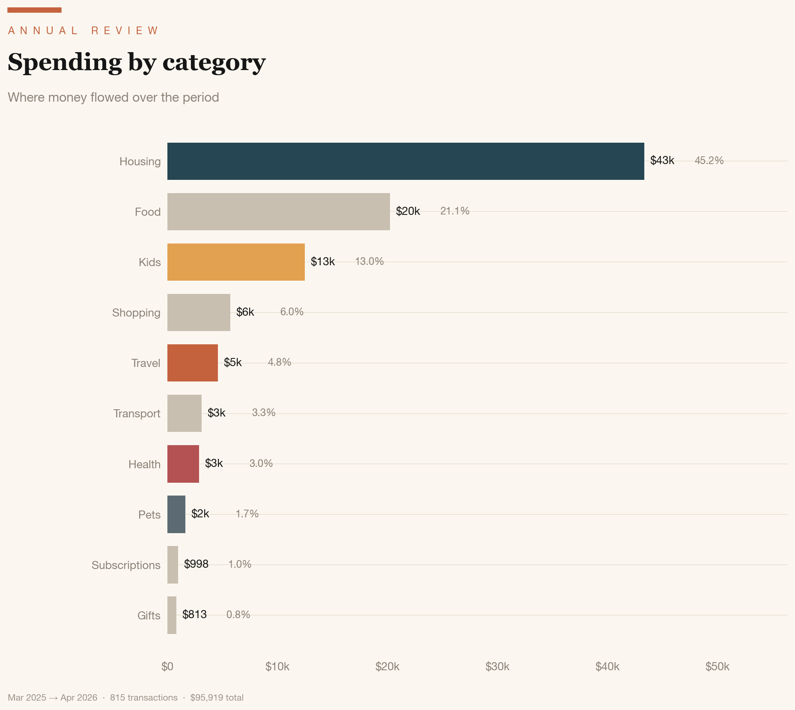
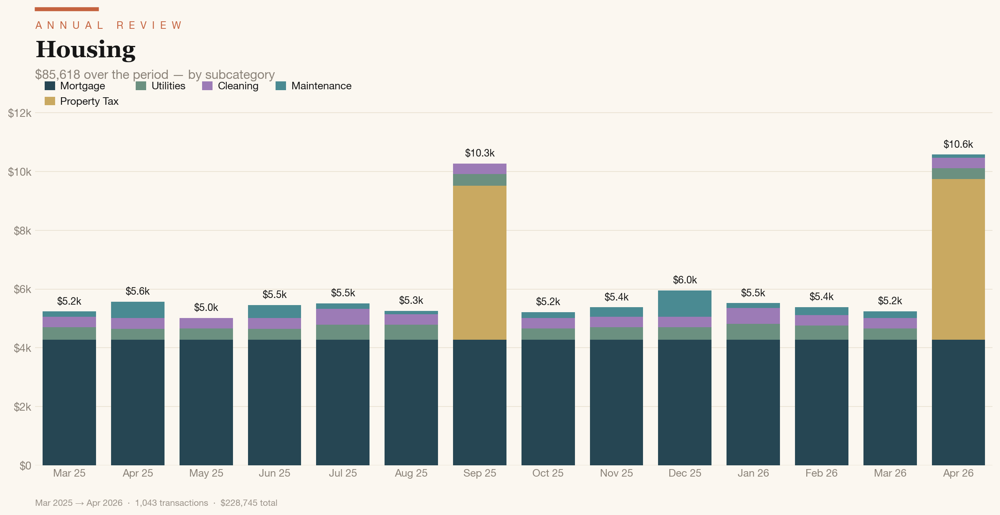
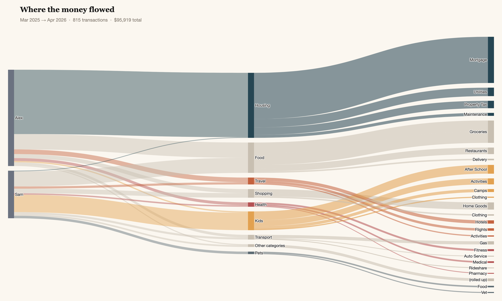

<h1 align="center">fsdmoney</h1>

<p align="center"><b>Full self-driving for your money.</b></p>

<p align="center">
  <a href="LICENSE"></a>
  <a href="https://docs.claude.com/claude-code"></a>
  <a href="#-skills"></a>
  <a href="#privacy"></a>
</p>

<p align="center">
  <a href="#how-it-works">How it works</a>
  &nbsp;·&nbsp;
  <a href="#quickstart">Quickstart</a>
  &nbsp;·&nbsp;
  <a href="#privacy">Privacy</a>
  &nbsp;·&nbsp;
  <a href="#-skills">Skills</a>
</p>

---

`fsdmoney` is a set of Claude Code skills for managing your personal
finances. Your statements stay on your local disk; Claude analyzes them
in your own Code session, with nothing uploaded or shared with a third
party. We plan a set of skills to address different stages of personal
finance: expenses, investments, income & taxes, planning. Expenses is
the first to go live.

## 📦 Skills

| Skill | Status | What it does |
| --- | --- | --- |
| **expenses** |  | Categorise & analyse spending |
| **investment-analysis** |  | Aggregate and analyse your *current* investment portfolio |
| **income** |  | W-2 income breakdown — gross, tax stack, take-home |
| **taxes** |  | Annualised position, deductions, estimates |
| **retirement** |  | Projection, contribution gaps, Roth split |

---

## How it works

Every fsdmoney skill follows the same shape:

1. **You drop raw data** — bank and card statements, brokerage PDFs, a
   W-2 — into a folder. No exports to a third party, no account
   linking, no Plaid.
2. **Claude reads it locally** in your Code session and parses the
   messy bits: mixed PDF/CSV formats, statement quirks, line items
   buried in footnotes.
3. **Interview-style cleanup.** Claude asks about your household,
   accounts, and edge cases, then iterates with you until the numbers
   feel right.
4. **Descriptive output, not advice.** You get a clean ledger, charts,
   and commentary on what stands out. The skills describe current
   state — they don't recommend trades, budgets, or contribution
   changes. (That's a future layer.)
5. **Re-runs are cheap.** Your overrides and household structure are
   saved to a config file, so next month is incremental — not a fresh
   slog.

The **expenses** walkthrough below is the worked example. Other skills
(`investment-analysis`, `income`) follow the same pattern against
different inputs.

---

## expenses

Point Claude at a folder of credit-card and bank statements. You get a
clean ledger and a set of editorial charts that answer *where did the
money actually go* — without the manual slog.

<p align="center">
  
</p>

### Privacy

> **Local-first, no bank credentials.** Your statements stay on your
> machine. No Plaid, no account linking, no cloud sync, no third-party
> servers. You export your own statements (the way you would for a
> spreadsheet), drop them in a folder, and Claude reads them locally
> in your own Code session.

### What's different

- [x] **Better automatic categorisation.** Traditional tools rely on
  keyword matching and leave a long tail in *Misc*. fsdmoney uses
  Claude's semantic understanding of merchants and context, backed by
  web search when a name is unfamiliar. Typical first pass: <1% of
  transactions untagged.
- [x] **Ingestion that copes with reality.** PDFs and CSVs from
  multiple banks and credit-card issuers — including statement formats
  with quirks that break naive parsers.
- [x] **Deep analysis.** AI groups every charge tied to a trip
  (flights, hotels, rideshares, restaurants) — before, during, and
  after — into one logical trip object. Subscription audit and
  recurring-payment detection land here too.
- [x] **Validation & anomaly hunting.** Cross-checks parsed totals
  against each statement's own summary, then surfaces loan-payment
  drift, orphan flights without hotels, drifting subscriptions, and
  multiple loan-shaped streams from the same servicer.
- [x] **Cluster-fix, apply-everywhere.** Correct one misclassification
  and the rule applies to every past *and* future occurrence — written
  to `expenses_config.yaml` so it survives refreshes. Classical tools
  ask you again next month.
- [x] **Person attribution.** Joint cards split per cardholder column;
  per-person rollups for free.
- [x] **Property-aware.** Vacation homes get their own category;
  rental properties get their own income-and-expenses sheet
  (`Rental P&L.csv`) kept clean of personal lifestyle spend.
- [x] **Refunds netted, not dropped.** Refunds stay in the ledger as
  negative-amount rows in the original category — preserves the audit
  trail. Classical tools silently drop them.
- [x] **Exclusion audit.** Always reports what was excluded and why
  ("excluded $4,200 in card-payoff rows to avoid double-counting").
  Classical tools silently filter.
- [x] **Refresh delta.** "vs last refresh" comparison — new
  categories, dollar changes per category, new merchants since you
  last looked.
- [x] **Commentary, not just a spreadsheet.** Claude tells you what
  stands out, what changed since last refresh, and where to look next.

<p align="center">
  
  <br><br>
  
  <br><br>
  
  <br>
  <sub><i>Sankey: every dollar traced from person → category → subcategory.
  Also rendered as an interactive HTML for click-and-zoom exploration.</i></sub>
</p>

> You stay in the loop. Claude works interview-style — asking about
> your household and edge cases (vacation home? rental property? joint
> accounts?) — then iterates the cleanup with you until the numbers
> feel right.

### Quickstart

```bash
# 1. Install the skill
git clone https://github.com/geod/fsdmoney.git
cp -r fsdmoney/.claude/skills/expenses ~/.claude/skills/

# 2. Put your checking account and credit card statements in a folder
# CSVs and PDFs both fine
# 12 months is ideal to get a full yearly cycle
cd ~/Documents/2026-finances/

# 3. Open Claude Code and ask
claude "Help me understand my expenses"
```

### Requirements

Python 3.10+, with `pandas`, `pdfplumber`, `pyyaml`, `matplotlib`.
Optional: `plotly` for the Sankey diagram.

---

<sub>Screenshots above are rendered from a synthetic dataset
(`docs/generate_screenshots.py`) — no real personal data is included
in this repo.</sub>
